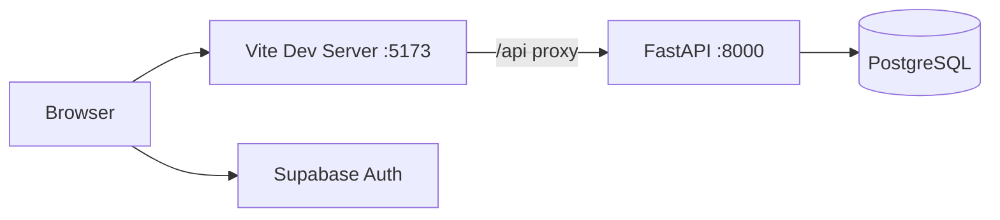

# Employee Management System

A full-stack, multi-tenant employee management platform with separate **admin** and **employee** experiences. The React frontend handles authentication via Supabase and talks to a FastAPI backend backed by PostgreSQL.

## Features

### Admin

- Dashboard and user management
- Role-based access control (RBAC)
- Project assignments and workflows
- Attendance, leave, and time-tracking oversight
- Announcements and notifications

### Employee

- Personal dashboard and profile
- Project views and progress
- Attendance check-in (including face capture)
- Leave requests and time tracking
- Announcements and in-app notifications

### Platform

- Multi-tenant organizations
- Supabase auth on the frontend; JWT-backed API on the backend
- REST API with OpenAPI docs (`/docs`)

## Repository Structure

```
employee-project-copy/
├── frontend/          # React + TypeScript + Vite admin/employee UI
├── backend/           # FastAPI API, SQLAlchemy, Alembic migrations
├── supabase/          # Supabase SQL migrations and helpers
├── SETUP_FACE_PHOTOS.md   # Supabase Storage setup for attendance photos
└── README.md          # This file
```

| Folder | Stack | Details |
|--------|-------|---------|
| [frontend/](frontend/) | React 18, TypeScript, Vite, React Router, Supabase JS | Port **5173**; proxies `/api` → backend |
| [backend/](backend/) | FastAPI, SQLAlchemy, Alembic, PostgreSQL | Port **8000**; see [backend/README.md](backend/README.md) |
| [supabase/](supabase/) | SQL migrations | Optional schema alongside backend Alembic |

## Prerequisites

- **Node.js** 18+ and npm (frontend)
- **Python** 3.14+ and [uv](https://docs.astral.sh/uv/) (backend; see `backend/.python-version`)
- **PostgreSQL** database
- **Supabase** project (auth; optional storage for face photos)

## Quick Start

### 1. Clone the repository

```bash
git clone <repository-url>
cd employee-project-copy
```

### 2. Backend

```bash
cd backend
cp .env.example .env
# Edit .env — set DATABASE_URL, SUPABASE_JWT_SECRET, CORS origins, etc.

uv sync
alembic upgrade head
uv run python seed.py          # optional: default tenant + admin user
uv run uvicorn src.main:app --reload --host 0.0.0.0 --port 8000
```

API: http://localhost:8000  
Docs: http://localhost:8000/docs

Full backend setup, env vars, migrations, and API reference: **[backend/README.md](backend/README.md)**

### 3. Frontend

```bash
cd frontend
npm install
npm run dev
```

App: http://localhost:5173  

Vite proxies `/api` to `http://localhost:8000`, so the UI can call the backend without CORS issues during development.

### 4. Supabase (frontend auth)

Configure your Supabase URL and anon key in `frontend/src/lib/supabase.ts` (or move them to environment variables for production).

For attendance face photos, create the `face-photos` storage bucket — see **[SETUP_FACE_PHOTOS.md](SETUP_FACE_PHOTOS.md)**.

## Running Both Services

Use two terminals:

| Service | Command | URL |
|---------|---------|-----|
| Backend | `cd backend && uv run uvicorn src.main:app --reload --port 8000` | http://localhost:8000 |
| Frontend | `cd frontend && npm run dev` | http://localhost:5173 |

Ensure `BACKEND_CORS_ORIGINS` in `backend/.env` includes `http://localhost:5173`.

## Environment Variables

### Backend (`backend/.env`)

Copy from `backend/.env.example`. Minimum for local dev:

- `DATABASE_URL` — PostgreSQL connection string
- `SUPABASE_JWT_SECRET` — must match what the API uses to validate tokens
- `FRONTEND_URL` — e.g. `http://localhost:5173`
- `BACKEND_CORS_ORIGINS` — JSON array of allowed origins

Optional: Redis, SendGrid, Stripe, AWS S3, OpenAI, Firebase (documented in `.env.example`).

### Frontend

- Supabase project URL and anon key (currently in `frontend/src/lib/supabase.ts`)
- API calls use `/api/v1` via the Vite dev proxy (no separate `VITE_API_URL` required in dev)

## Default Seed Credentials

After `uv run python seed.py` in `backend/`:

| Field | Value |
|-------|-------|
| Email | `admin@example.com` |
| Password | `admin123` |

Use these only in local development; change or remove seeded users before production.

## Development Scripts

### Frontend

```bash
npm run dev      # Start Vite dev server
npm run build    # Production build
npm run preview  # Preview production build
npm run lint     # ESLint
```

### Backend

```bash
uv run uvicorn src.main:app --reload --port 8000
alembic upgrade head
alembic revision --autogenerate -m "description"
uv run python seed.py
uv run python seed_projects.py
```

## Architecture Overview



1. Users sign in through **Supabase Auth** in the frontend.
2. The frontend sends the Supabase access token to **FastAPI** (`Authorization: Bearer …`).
3. The backend validates JWTs, enforces RBAC, and persists data in **PostgreSQL**.

## Related Documentation

- [backend/README.md](backend/README.md) — API setup, migrations, endpoints
- [frontend/README.md](frontend/README.md) — legacy frontend notes (may be outdated)
- [SETUP_FACE_PHOTOS.md](SETUP_FACE_PHOTOS.md) — Supabase Storage for face capture

## License

MIT (see `frontend/package.json`). Adjust as needed for your organization.
